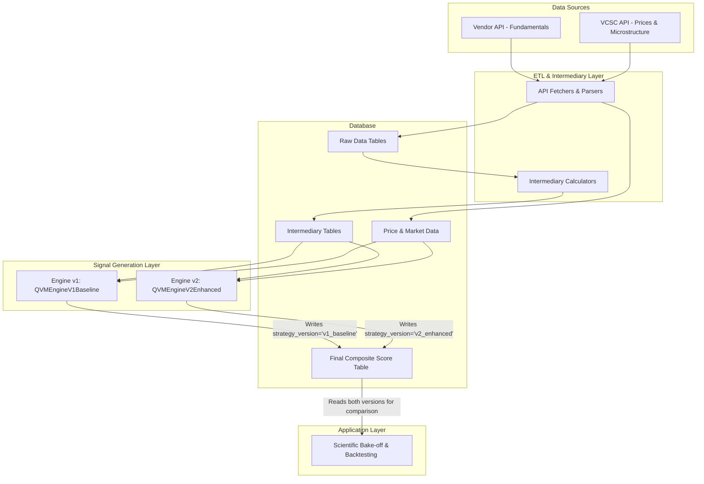
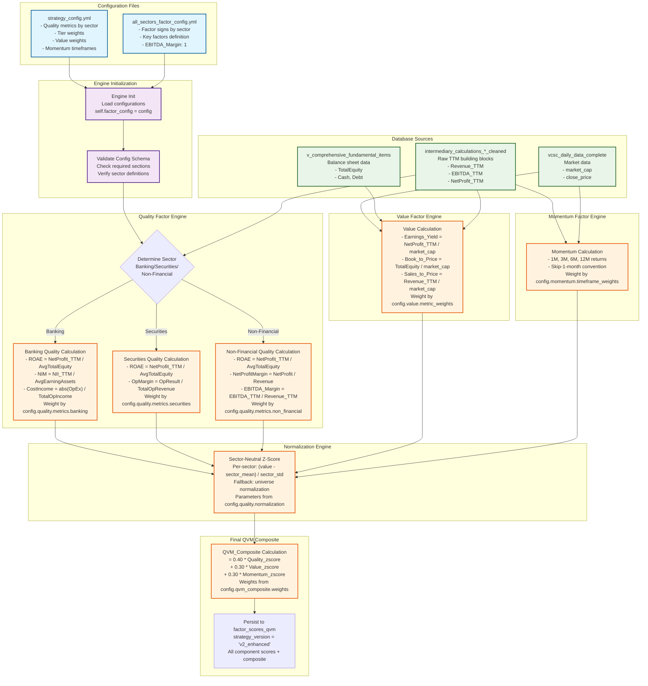

# **Part 2: System Architecture & Database Schema**

**Document Name:** `02_system_architecture.md`
**Version:** 3.0 (Definitive Merged Version)
**Date:** July 22, 2025
**Status:** ✅ **ACTIVE - SINGLE SOURCE OF TRUTH**
**Owner:** Duc Nguyen, Principal Quantitative Strategist

## **1. Architectural Vision: Integrity, Flexibility, and Traceability**

The platform's architecture is guided by three institutional principles, refined through rigorous testing and operational experience.

*   **Principle 1: Store Raw Building Blocks, Calculate Signals Dynamically.** We do not store pre-calculated ratios (like ROAE or P/E) in our database. Instead, we store their raw, point-in-time correct TTM components (e.g., `NetProfit_TTM`, `AvgTotalEquity`) in the `intermediary_calculations_*` tables. During a factor generation run, our engines calculate all ratios and composites dynamically in memory. This guarantees maximum research flexibility and eliminates the risk of data contamination from issues like percentage storage errors.

*   **Principle 2: Persist Final Composite Scores with Versioning.** The final, composite scores (`Quality_Composite`, `Value_Composite`, etc.) generated by a specific engine version are persisted in the `factor_scores_qvm` table. The `strategy_version` column is critical, as it allows us to store the outputs of our scientific bake-off (e.g., 'v1_baseline' vs. 'v2_enhanced') in the same table for direct comparison. This provides a high-performance, immutable "single source of truth" for backtesting.

*   **Principle 3: Separate Signal Generation from Portfolio Construction.** The factor engines are responsible only for generating pure, sector-neutral alpha signals. A separate portfolio construction layer (e.g., an optimizer or a high-fidelity backtester like `backtrader`) is responsible for applying risk constraints and building the final portfolio.

## **2. System & Data Flow Architecture for Scientific Bake-Off**

The system is designed as a multi-layer pipeline that explicitly supports our scientific bake-off methodology, ensuring a traceable flow from raw data to competing factor scores.




## **2.1. Enhanced QVM Engine v2: Config-Driven Factor Calculation Flow**

The Enhanced QVM Engine v2 implements a sophisticated config-driven architecture where factor definitions, weights, and calculations are dynamically loaded from YAML configuration files. This diagram shows the complete flow from configuration to final factor scores:




### **Key Features of the Config-Driven Architecture:**

1. **Dynamic Metric Loading**: Engine reads quality metrics lists from `strategy_config.yml` for each sector
2. **Flexible Weight Management**: All factor weights (tier, composite, timeframe) sourced from configuration
3. **Sector-Specific Logic**: Different calculation paths based on sector classification
4. **Centralized Normalization**: Consistent z-score parameters across all factors
5. **Version Control**: Each engine version can have different configs while using same database

### **Critical Fix Applied**: 
- **EBITDA_Margin Calculation**: Added `EBITDA_TTM / Revenue_TTM` to non-financial quality section
- **Config Integration**: Engine now reads and applies `strategy_config.yml` metric definitions
- **Banking Sign Convention**: Applied `abs()` to expense calculations for proper cost ratios

This architecture ensures that factor definitions remain consistent, auditable, and easily modifiable without touching the core engine code.

## **3. Database Schema Deep Dive**

This section provides the definitive schema for all critical tables within the `alphabeta` database.

### **3.1. Layer 1: Raw Data Storage**

#### **`fundamental_values`**
*   **Purpose:** Stores raw, unadjusted quarterly financial statement line items in a normalized (long) format. This is the foundational source for all fundamental analysis.
*   **Status:** ✅ Production-Ready

```sql
CREATE TABLE fundamental_values (
    id INT NOT NULL AUTO_INCREMENT,
    ticker VARCHAR(10) NOT NULL,
    item_id INT NOT NULL,
    statement_type ENUM('PL','BS','CF') NOT NULL,
    year INT NOT NULL,
    quarter INT NOT NULL,
    value DECIMAL(20,2),
    PRIMARY KEY (id),
    INDEX idx_ticker_item_date (ticker, item_id, year, quarter)
);
```

### **3.2. Layer 2: Price & Market Data**

#### **`equity_history`** ⭐ **PRIMARY MOMENTUM SOURCE**
*   **Purpose:** The definitive source for clean, corporate-action-adjusted daily OHLCV data. **Must** be used for all return and momentum calculations.
*   **Status:** ✅ Production-Ready, Daily Updates

```sql
CREATE TABLE equity_history (
    date DATE NOT NULL,
    ticker VARCHAR(10) NOT NULL,
    open DOUBLE,
    high DOUBLE,
    low DOUBLE,
    close DOUBLE,  -- ADJUSTED close price
    volume DOUBLE,
    PRIMARY KEY (date, ticker)
);
```

#### **`vcsc_daily_data_complete`** ⭐ **PRIMARY VALUE & MICROSTRUCTURE SOURCE**
*   **Purpose:** The definitive source for daily price, volume, market cap, and foreign flow data. Contains over 66 columns of rich microstructure data. **Must** be used for all valuation ratios (P/E, P/B, etc.).
*   **Status:** ✅ Production-Ready, Daily Updates

```sql
CREATE TABLE vcsc_daily_data_complete (
    ticker VARCHAR(10) NOT NULL,
    trading_date DATE NOT NULL,
    vcsc_id VARCHAR(50),
    stock_type VARCHAR(50),
    time_frame VARCHAR(20),
    -- Price Data (19 columns)
    open_price DECIMAL(20,2),
    high_price DECIMAL(20,2),
    low_price DECIMAL(20,2),
    close_price DECIMAL(20,2),
    match_price DECIMAL(20,2),
    average_price DECIMAL(20,2),
    reference_price_adjusted DECIMAL(20,2),
    open_price_adjusted DECIMAL(20,2),
    high_price_adjusted DECIMAL(20,2),
    low_price_adjusted DECIMAL(20,2),
    close_price_adjusted DECIMAL(20,2),
    price_change DECIMAL(20,2),
    percent_price_change DECIMAL(10,4),
    price_change_adjusted DECIMAL(20,2),
    percent_price_change_adjusted DECIMAL(10,4),
    ceiling_price DECIMAL(20,2),
    floor_price DECIMAL(20,2),
    reference_price DECIMAL(20,2),
    -- Market Cap Data (2 columns)
    total_shares BIGINT,
    market_cap DECIMAL(20,2),
    -- Volume Data (12 columns)
    total_match_volume BIGINT,
    total_match_value DECIMAL(20,2),
    total_deal_volume BIGINT,
    total_deal_value DECIMAL(20,2),
    total_volume BIGINT,
    total_value DECIMAL(20,2),
    total_buy_trade_volume BIGINT,
    total_sell_trade_volume BIGINT,
    average_buy_trade_volume DECIMAL(20,2),
    average_sell_trade_volume DECIMAL(20,2),
    total_net_trade_volume BIGINT,
    total_buy_unmatched_volume BIGINT,
    total_sell_unmatched_volume BIGINT,
    -- Foreign Flow Data (12 columns)
    foreign_buy_value_matched DECIMAL(20,2),
    foreign_sell_value_matched DECIMAL(20,2),
    foreign_net_value_matched DECIMAL(20,2),
    foreign_buy_volume_matched BIGINT,
    foreign_sell_volume_matched BIGINT,
    foreign_net_volume_matched BIGINT,
    foreign_buy_value_deal DECIMAL(20,2),
    foreign_sell_value_deal DECIMAL(20,2),
    foreign_net_value_deal DECIMAL(20,2),
    foreign_buy_volume_deal BIGINT,
    foreign_sell_volume_deal BIGINT,
    foreign_net_volume_deal BIGINT,
    -- Foreign Room Data (5 columns)
    foreign_total_room BIGINT,
    foreign_current_room BIGINT,
    foreign_owned_percentage DECIMAL(10,4),
    foreign_available_percentage DECIMAL(10,4),
    foreign_room_percentage DECIMAL(10,4),
    created_at TIMESTAMP DEFAULT CURRENT_TIMESTAMP,
    PRIMARY KEY (ticker, trading_date)
);
```

### **3.3. Layer 3: Pre-Calculated Intermediaries**

This layer is the performance and precision engine of the platform. It stores pre-calculated TTM and averaged values to accelerate research and ensure mathematical rigor.

#### **`intermediary_calculations_enhanced`**
*   **Purpose:** Stores pre-calculated TTM values, 5-point averages, and working capital metrics for all non-financial sectors.
*   **Status:** ✅ Production-Ready, Fully Populated

```sql
CREATE TABLE intermediary_calculations_enhanced (
    -- === Primary Key & Metadata (8 columns) ===
    ticker CHAR(10) NOT NULL,
    year INT NOT NULL,
    quarter INT NOT NULL,
    calc_date DATE NOT NULL,
    quarters_available TINYINT,
    has_full_ttm BOOLEAN,
    avg_points_used TINYINT,
    has_full_avg BOOLEAN,

    -- === TTM Flow Metrics (21 columns) ===
    Revenue_TTM DECIMAL(30,2),
    COGS_TTM DECIMAL(30,2),
    GrossProfit_TTM DECIMAL(30,2),
    SellingExpenses_TTM DECIMAL(30,2),
    AdminExpenses_TTM DECIMAL(30,2),
    OperatingExpenses_TTM DECIMAL(30,2),
    FinancialIncome_TTM DECIMAL(30,2),
    FinancialExpenses_TTM DECIMAL(30,2),
    InterestExpense_TTM DECIMAL(30,2),
    EBIT_TTM DECIMAL(30,2),
    EBITDA_TTM DECIMAL(30,2),
    ProfitBeforeTax_TTM DECIMAL(30,2),
    CurrentTax_TTM DECIMAL(30,2),
    DeferredTax_TTM DECIMAL(30,2),
    TotalTax_TTM DECIMAL(30,2),
    NetProfit_TTM DECIMAL(30,2),
    NetProfitAfterMI_TTM DECIMAL(30,2),
    NetCFO_TTM DECIMAL(30,2),
    NetCFI_TTM DECIMAL(30,2),
    NetCFF_TTM DECIMAL(30,2),
    FCF_TTM DECIMAL(30,2),

    -- === 5-Point Balance Sheet Averages (17 columns) ===
    AvgTotalAssets DECIMAL(30,2),
    AvgCurrentAssets DECIMAL(30,2),
    AvgFixedAssets DECIMAL(30,2),
    AvgCash DECIMAL(30,2),
    AvgInventory DECIMAL(30,2),
    AvgReceivables DECIMAL(30,2),
    AvgTotalLiabilities DECIMAL(30,2),
    AvgCurrentLiabilities DECIMAL(30,2),
    AvgPayables DECIMAL(30,2),
    AvgShortTermDebt DECIMAL(30,2),
    AvgLongTermDebt DECIMAL(30,2),
    AvgTotalDebt DECIMAL(30,2),
    AvgNetDebt DECIMAL(30,2),
    AvgTotalEquity DECIMAL(30,2),
    AvgRetainedEarnings DECIMAL(30,2),
    AvgWorkingCapital DECIMAL(30,2),
    AvgInvestedCapital DECIMAL(30,2),

    -- === Working Capital Metrics (4 columns) ===
    DSO DECIMAL(10,2),
    DIO DECIMAL(10,2),
    DPO DECIMAL(10,2),
    CCC DECIMAL(10,2),

    -- === Constraints and Indexes ===
    PRIMARY KEY (ticker, year, quarter),
    INDEX idx_period_ticker (year, quarter, ticker)
) ENGINE=InnoDB COMMENT='Stores high-fidelity intermediary values for non-financial factor construction, featuring Enhanced DPO.';
```

#### **`intermediary_calculations_banking_cleaned`**
*   **Purpose:** Stores raw TTM building blocks for the Banking sector, without pre-calculated ratios, to prevent percentage storage errors.
*   **Status:** ✅ Production-Ready

```sql
CREATE TABLE intermediary_calculations_banking_cleaned (
    ticker CHAR(10) NOT NULL,
    year INT NOT NULL,
    quarter INT NOT NULL,
    calc_date DATE NOT NULL,
    
    -- TTM Flow Values (Raw Building Blocks)
    NII_TTM DECIMAL(30,2),
    InterestIncome_TTM DECIMAL(30,2),
    InterestExpense_TTM DECIMAL(30,2),
    NetFeeIncome_TTM DECIMAL(30,2),
    ForexIncome_TTM DECIMAL(30,2),
    TradingIncome_TTM DECIMAL(30,2),
    InvestmentIncome_TTM DECIMAL(30,2),
    OtherIncome_TTM DECIMAL(30,2),
    EquityInvestmentIncome_TTM DECIMAL(30,2),
    OperatingExpenses_TTM DECIMAL(30,2),
    OperatingProfit_TTM DECIMAL(30,2),
    CreditProvisions_TTM DECIMAL(30,2),
    ProfitBeforeTax_TTM DECIMAL(30,2),
    TaxExpense_TTM DECIMAL(30,2),
    NetProfit_TTM DECIMAL(30,2),
    NetProfitAfterMI_TTM DECIMAL(30,2),
    
    -- 5-Point Balance Sheet Averages (Raw Building Blocks)
    AvgTotalAssets DECIMAL(30,2),
    AvgGrossLoans DECIMAL(30,2),
    AvgLoanLossReserves DECIMAL(30,2),
    AvgNetLoans DECIMAL(30,2),
    AvgTradingSecurities DECIMAL(30,2),
    AvgInvestmentSecurities DECIMAL(30,2),
    AvgCash DECIMAL(30,2),
    AvgCustomerDeposits DECIMAL(30,2),
    AvgTotalEquity DECIMAL(30,2),
    AvgPaidInCapital DECIMAL(30,2),
    AvgEarningAssets DECIMAL(30,2),
    AvgTotalDeposits DECIMAL(30,2),
    AvgBorrowings DECIMAL(30,2),
    
    -- Complex Aggregations (Kept)
    TotalOperatingIncome_TTM DECIMAL(30,2),
    NonInterestIncome_TTM_Raw DECIMAL(30,2),
    
    -- Metadata  
    quarters_available_ttm INT,
    has_full_ttm TINYINT(1),
    avg_points_used INT,
    has_full_avg TINYINT(1),
    data_quality_score DECIMAL(5,2),
    
    PRIMARY KEY (ticker, year, quarter),
    INDEX idx_ticker (ticker),
    INDEX idx_year_quarter (year, quarter),
    INDEX idx_calc_date (calc_date)
) ENGINE=InnoDB COMMENT='Phase 5 cleaned banking intermediary table - stores only raw building blocks without pre-calculated ratios';
```

#### **`intermediary_calculations_securities_cleaned`**
*   **Purpose:** Stores raw TTM building blocks for the Securities sector.
*   **Status:** ✅ Production-Ready

```sql
CREATE TABLE intermediary_calculations_securities_cleaned (
    ticker CHAR(10) NOT NULL,
    year INT NOT NULL,
    quarter INT NOT NULL,
    calc_date DATE NOT NULL,
    
    -- TTM Revenue Values (Raw Building Blocks)
    BrokerageRevenue_TTM DECIMAL(30,2),
    UnderwritingRevenue_TTM DECIMAL(30,2),
    AdvisoryRevenue_TTM DECIMAL(30,2),
    CustodyServiceRevenue_TTM DECIMAL(30,2),
    EntrustedAuctionRevenue_TTM DECIMAL(30,2),
    OtherOperatingIncome_TTM DECIMAL(30,2),
    TradingGainFVTPL_TTM DECIMAL(30,2),
    TradingGainHTM_TTM DECIMAL(30,2),
    TradingGainLoans_TTM DECIMAL(30,2),
    TradingGainAFS_TTM DECIMAL(30,2),
    TradingGainDerivatives_TTM DECIMAL(30,2),
    ManagementExpenses_TTM DECIMAL(30,2),
    OperatingResult_TTM DECIMAL(30,2),
    ProfitBeforeTax_TTM DECIMAL(30,2),
    IncomeTaxExpense_TTM DECIMAL(30,2),
    NetProfit_TTM DECIMAL(30,2),
    
    -- 5-Point Balance Sheet Averages (Raw Building Blocks)
    AvgTotalAssets DECIMAL(30,2),
    AvgFinancialAssets DECIMAL(30,2),
    AvgCashAndCashEquivalents DECIMAL(30,2),
    AvgFinancialAssetsFVTPL DECIMAL(30,2),
    AvgLoanReceivables DECIMAL(30,2),
    AvgTotalEquity DECIMAL(30,2),
    AvgCharterCapital DECIMAL(30,2),
    AvgRetainedEarnings DECIMAL(30,2),
    
    -- Complex Aggregations (Kept)
    TotalSecuritiesServices_TTM DECIMAL(30,2),
    NetTradingIncome_TTM DECIMAL(30,2),
    TotalOperatingRevenue_TTM DECIMAL(30,2),
    
    -- Metadata
    quarters_available_ttm INT,
    has_full_ttm TINYINT(1),
    avg_points_used INT,
    has_full_avg TINYINT(1),
    data_quality_score DECIMAL(5,2),
    
    PRIMARY KEY (ticker, year, quarter),
    INDEX idx_ticker (ticker),
    INDEX idx_year_quarter (year, quarter),
    INDEX idx_calc_date (calc_date)
) ENGINE=InnoDB COMMENT='Phase 5 cleaned securities intermediary table - stores only raw building blocks without pre-calculated ratios';
```

### **3.4. Layer 4: Final Composite Scores**

#### **`factor_scores_qvm`** ⭐ **DEFINITIVE BACKTESTING SOURCE**
*   **Purpose:** Stores the final, versioned composite factor scores generated by our different engine versions. This is the single source of truth for all backtesting and performance analysis.
*   **Status:** ✅ Production-Ready, Populated by Production Scripts

```sql
CREATE TABLE factor_scores_qvm (
    id BIGINT NOT NULL AUTO_INCREMENT,
    ticker VARCHAR(10) NOT NULL,
    date DATE NOT NULL,
    Quality_Composite DECIMAL(20, 6),
    Value_Composite DECIMAL(20, 6),
    Momentum_Composite DECIMAL(20, 6),
    QVM_Composite DECIMAL(20, 6),
    calculation_timestamp TIMESTAMP NOT NULL DEFAULT CURRENT_TIMESTAMP,
    strategy_version VARCHAR(50) NOT NULL COMMENT 'e.g., v1_baseline, v2_enhanced',
    PRIMARY KEY (id),
    UNIQUE KEY uq_ticker_date_version (ticker, date, strategy_version),
    INDEX idx_date_version (date, strategy_version)
) ENGINE=InnoDB COMMENT='Stores final, versioned composite scores for backtesting.';
```

### **3.5. Metadata**
*   **`master_info`**: The single source of truth for all ticker metadata, including sector and industry classifications.

## **4. Data Access Patterns & Rules**

To maintain research integrity, all development **must** adhere to the following rules:

*   **For Factor Generation (Engines v1 & v2):**
    *   **Must** read from `intermediary_calculations_*` tables for fundamental building blocks.
    *   **Must** read from `equity_history` for momentum calculations.
    *   **Must** read from `vcsc_daily_data_complete` for market cap and other value-related inputs.
    *   **Must** use a robust, unified function for all point-in-time balance sheet lookups (e.g., for P/B and EV components) to prevent data retrieval errors.
    *   **Must** write their final composite scores to the `factor_scores_qvm` table with the correct `strategy_version` tag (e.g., 'v1_baseline' or 'v2_enhanced').

*   **For Backtesting & Analysis:**
    *   **Must** query the `factor_scores_qvm` table as the primary input.
    *   To compare engine performance, filter by `strategy_version`:
        ```sql
        -- Fetch results for the Enhanced engine
        SELECT * FROM factor_scores_qvm WHERE strategy_version = 'v2_enhanced';
        ```
    *   All queries must use a strict `date <= :as_of_date` clause to prevent look-ahead bias.

## **5. Vietnam-Specific Architectural Decisions**

The platform architecture includes several key decisions made specifically to handle the nuances of the Vietnamese market:

*   **Calculated EBIT:** We do not use the reported "Operating Profit" from Vietnamese financial statements, as it includes financial items. We calculate a standardized EBIT (`Gross Profit - Operating Expenses`) in the `intermediary_calculations_enhanced` table to ensure international comparability.
*   **Sector-Specific Views:** The creation of dedicated views for Banking, Securities, and Insurance is necessary to handle their unique financial statement structures and regulatory reporting requirements.
*   **SOE vs. Private Normalization:** The architecture supports, and the methodology requires, separate normalization universes for State-Owned Enterprises vs. Private companies. This is handled within the factor engines during the dynamic calculation phase.

---
---

This definitive, merged version is now complete. Please confirm, and I will provide the next fully refined document: **`02a_qvm_engine_v2_enhanced_specification.md`**.