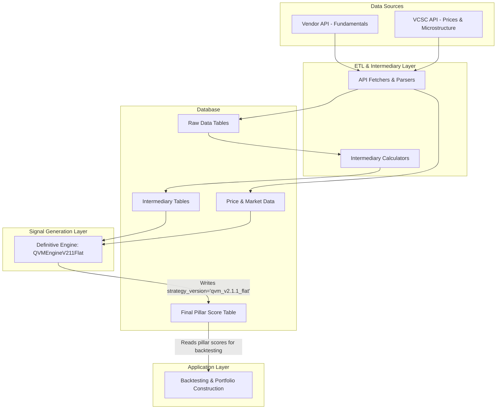
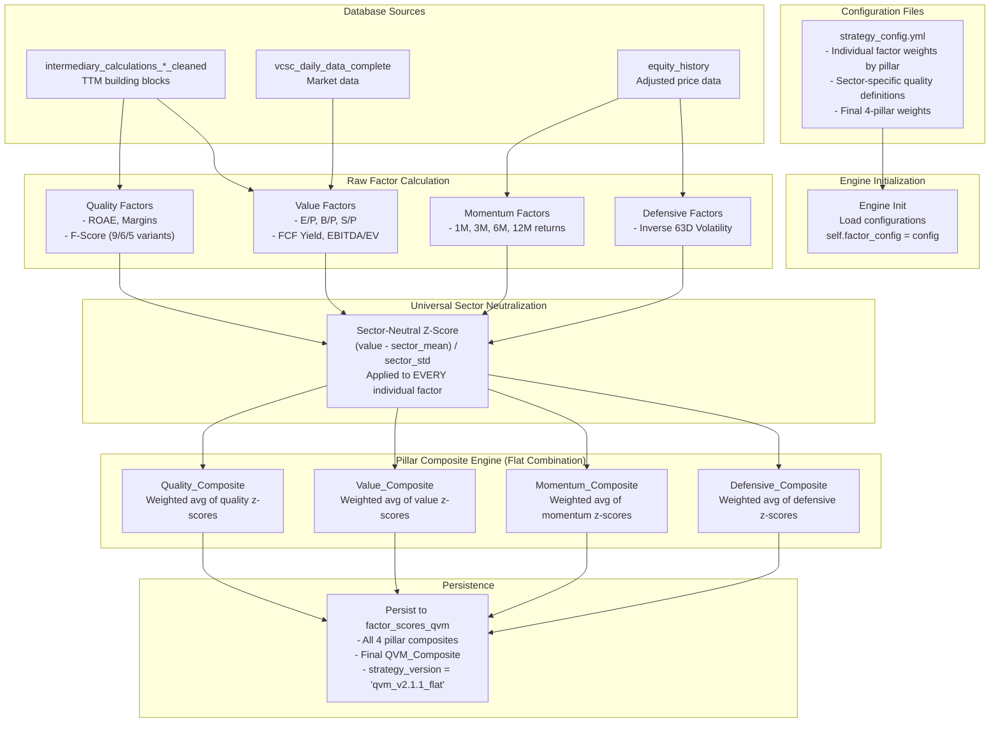

# **System Architecture v4.0 - Vietnam Factor Investing Platform**

**Document Name:** `02_system_architecture_v4.0.md`
**Version:** 4.0 (Definitive - Flat Methodology)
**Date:** August 5, 2025
**Status:** ✅ **ACTIVE - SINGLE SOURCE OF TRUTH**
**Owner:** Duc Nguyen, Principal Quantitative Strategist

## **Changelog (v3.0 -> v4.0)**
*   **Canonization of Flat Methodology:** All diagrams and descriptions have been rewritten to reflect the `qvm_engine_v2_1_1_flat` as the sole production engine. All references to hierarchical or nested composites have been removed.
*   **Updated Engine Flow Diagram:** The "QVM Engine v2" diagram has been replaced with a new, more detailed diagram illustrating the 4-pillar flat composite architecture, including the new Defensive, F-Score, and FCF Yield factors.
*   **Enhanced Database Schema:** The schema for `factor_scores_qvm` has been updated to include the four pillar composite scores, enabling full attribution analysis and dynamic strategy backtesting.

## **1. Architectural Vision: Integrity, Flexibility, and Traceability**

The platform's architecture is guided by three institutional principles, refined through rigorous testing and operational experience.

*   **Principle 1: Store Raw Building Blocks, Calculate Signals Dynamically.** We do not store pre-calculated ratios (like ROAE or P/E) in our database. Instead, we store their raw, point-in-time correct TTM components (e.g., `NetProfit_TTM`, `AvgTotalEquity`) in the `intermediary_calculations_*` tables. During a factor generation run, our engine calculates all ratios and composites dynamically in memory. This guarantees maximum research flexibility and eliminates data contamination risk.

*   **Principle 2: Persist Final Pillar Scores with Versioning.** The final, composite scores for each of the four pillars (`Quality_Composite`, `Value_Composite`, etc.) generated by a specific engine version are persisted in the `factor_scores_qvm` table. The `strategy_version` column is critical, as it allows us to store the outputs of different engines (e.g., 'v1_baseline' vs. 'v2.1.1_flat') in the same table for direct comparison. This provides a high-performance, immutable "single source of truth" for backtesting.

*   **Principle 3: Separate Signal Generation from Portfolio Construction.** The factor engine (`qvm_engine_v2_1_1_flat.py`) is responsible only for generating pure, sector-neutral alpha signals (the pillar scores). A separate portfolio construction layer (e.g., a backtester or optimizer) is responsible for applying risk constraints and building the final portfolio. This separation allows for dynamic strategy testing (e.g., factor timing) without re-running the expensive signal generation process.

## **2. System & Data Flow: The `v2.1.1_flat` Engine**

The system is designed as a multi-layer pipeline that generates four independent, sector-neutralized pillar scores.



### **2.1. QVM Engine v2.1.1 Flat: Factor Calculation Flow**

This diagram shows the complete flow within the definitive `qvm_engine_v2_1_1_flat.py`, from configuration to the final four pillar scores.



## **3. Database Schema Deep Dive**

This section provides the definitive schema for all critical tables within the `alphabeta` database.

### **3.1. Layer 1 & 2: Raw & Market Data**
*   `fundamental_values`, `equity_history`, `vcsc_daily_data_complete`: Schemas are unchanged and remain the foundational sources.

### **3.2. Layer 3: Pre-Calculated Intermediaries**
*   `intermediary_calculations_enhanced`, `intermediary_calculations_banking_cleaned`, `intermediary_calculations_securities_cleaned`: Schemas are unchanged. They correctly store the raw TTM building blocks required by the engine.

### **3.3. Layer 4: Final Pillar Scores**

#### **`factor_scores_qvm`** ⭐ **DEFINITIVE BACKTESTING SOURCE (ENHANCED SCHEMA)**
*   **Purpose:** Stores the final, versioned pillar scores generated by our engine. This is the single source of truth for all backtesting and performance analysis, enabling full attribution and dynamic strategy testing.
*   **Status:** ✅ Production-Ready, Populated by `run_factor_generation.py`

```sql
CREATE TABLE factor_scores_qvm (
    id BIGINT NOT NULL AUTO_INCREMENT,
    ticker VARCHAR(10) NOT NULL,
    date DATE NOT NULL,
    -- Pillar Composites (Sector-Neutral Z-Scores)
    Quality_Composite DECIMAL(20, 10),
    Value_Composite DECIMAL(20, 10),
    Momentum_Composite DECIMAL(20, 10),
    Defensive_Composite DECIMAL(20, 10),
    -- Final Weighted Score
    QVM_Composite DECIMAL(20, 10),
    -- Metadata
    calculation_timestamp TIMESTAMP NOT NULL DEFAULT CURRENT_TIMESTAMP,
    strategy_version VARCHAR(50) NOT NULL COMMENT 'e.g., v1_baseline, v2.1.1_flat',
    PRIMARY KEY (id),
    UNIQUE KEY uq_ticker_date_version (ticker, date, strategy_version),
    INDEX idx_date_version (date, strategy_version)
) ENGINE=InnoDB COMMENT='Stores final, versioned pillar scores for backtesting and attribution.';
```

## **4. Data Access Patterns & Rules**

To maintain research integrity, all development **must** adhere to the following rules:

*   **For Factor Generation (`qvm_engine_v2_1_1_flat.py`):**
    *   **Must** read from `intermediary_calculations_*` tables for fundamental building blocks.
    *   **Must** read from `equity_history` for momentum and volatility calculations.
    *   **Must** read from `vcsc_daily_data_complete` for market cap.
    *   **Must** write its final pillar scores to the `factor_scores_qvm` table with the `strategy_version` tag set to `v2.1.1_flat`.

*   **For Backtesting & Analysis:**
    *   **Must** query the `factor_scores_qvm` table as the primary input, filtering by `strategy_version`.
    *   For the canonical "Aggressive Growth" backtest, it will combine the four pillar scores using the weights defined in the config file.
    *   For dynamic strategy research (e.g., factor timing), it can load the four pillar scores and apply its own custom weighting scheme.

## **5. Vietnam-Specific Architectural Decisions**

The platform architecture includes several key decisions made specifically to handle the nuances of the Vietnamese market, which remain unchanged and validated:

*   **Calculated EBIT:** We continue to calculate a standardized EBIT (`Gross Profit - Operating Expenses`) to ensure international comparability.
*   **Sector-Specific Views:** The use of dedicated intermediary tables for Banking, Securities, and Non-Financials remains critical for handling their unique financial statement structures.
*   **SOE vs. Private Normalization:** The architecture supports, and the methodology requires, separate normalization universes for State-Owned Enterprises vs. Private companies. This is handled within the factor engine's sector-neutralization logic.

---
This definitive, merged version is now complete. Please confirm, and I will provide the next fully refined document: **`02a_qvm_engine_v2_1_1_flat_specification.md`**.