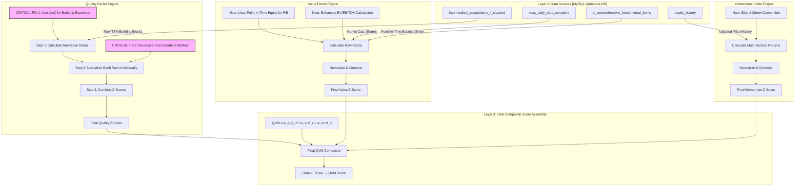

Of course. An excellent request. A conceptual diagram is essential for ensuring the implementation perfectly matches the institutional methodology we've defined. It serves as the definitive architectural blueprint.

Here is the detailed conceptual diagram and breakdown for the corrected `qvm_engine_v2_enhanced.py`.

### **EXECUTIVE SUMMARY**

This document provides the official conceptual blueprint for the corrected **QVM Engine v2 (Enhanced)**. The diagram illustrates the flow of data from our core database tables through three independent factor calculation "silos" (Quality, Value, Momentum) to the final composite QVM score. It explicitly details the **two critical corrections** that bring the engine up to institutional standards: the fix for the banking efficiency calculation and, most importantly, the implementation of the **"Normalize-then-Combine"** methodology for the Quality factor. This architecture ensures the pure, stock-specific alpha of each metric is isolated *before* being combined, which is the bedrock of robust factor construction.

### **DETAILED ANALYSIS: ENGINE CONCEPTUAL DIAGRAM**

---

### **Diagram Breakdown: Step-by-Step Logic**

This diagram illustrates a clean, modular, and methodologically sound process.

#### **Stage 1: Data Ingestion (Layer 1)**
The engine begins by sourcing data from our trusted, specialized tables:
*   **Quality:** Pulls raw Trailing-Twelve-Month (TTM) building blocks (e.g., `NetProfit_TTM`, `AvgTotalEquity`, `OperatingExpenses_TTM`) from the `intermediary_calculations_*_cleaned` tables.
*   **Value:** Pulls daily market capitalization from `vcsc_daily_data_complete` and point-in-time balance sheet items (e.g., `TotalEquity`, `TotalDebt`, `Cash`) from `v_comprehensive_fundamental_items`.
*   **Momentum:** Pulls corporate-action-adjusted daily price history from `equity_history`.

#### **Stage 2: The Quality Factor Engine (The Core Correction)**
This is where the most critical fixes are implemented, transforming the engine from flawed to institutional-grade.

*   **The Fatal Flaw (Old Method):** The previous logic incorrectly averaged raw, un-normalized metrics of different scales (e.g., ROAE % and a flawed Margin %), creating a meaningless composite signal which was then normalized.
*   **The Corrected Institutional Methodology (New Method):**
    1.  **Step 1: Calculate Raw Base Ratios.** The engine calculates the raw value for each individual quality metric (ROAE, ROAA, etc.).
        *   **CRITICAL FIX #1:** For banking metrics like Cost-to-Income, it now uses `abs(OperatingExpenses_TTM)` to correctly handle the negative sign convention in accounting data.
    2.  **Step 2: Normalize EACH Ratio Individually.** This is the heart of the new methodology. Each raw metric is immediately converted into its own sector-neutral z-score. For example:
        *   `ROAE_Raw` -> `ROAE_ZScore`
        *   `ROAA_Raw` -> `ROAA_ZScore`
        *   `Correct_CostToIncome_Raw` -> `Efficiency_ZScore`
    3.  **Step 3: Combine Z-Scores.** The final quality score is a weighted average of these *individual, standardized z-scores*, using the weights defined in our configuration files.
        *   `Final Quality Z-Score = w1*ROAE_ZScore + w2*ROAA_ZScore + w3*Efficiency_ZScore + ...`

This **"Normalize-then-Combine"** process ensures we are combining pure, comparable, stock-specific signals.

#### **Stage 3: The Value & Momentum Engines**
These engines were already on a solid foundation and continue to operate with sophistication:
*   **Value Engine:** Correctly uses point-in-time equity for P/B ratios and implements the enhanced EV/EBITDA calculation. It combines the raw inverted ratios (E/P, B/P, etc.) and then normalizes the final composite.
*   **Momentum Engine:** Calculates returns across multiple horizons (1, 3, 6, 12 months) while respecting the skip-1-month convention, then normalizes the final composite.

#### **Stage 4: Final QVM Composite Assembly (Layer 3)**
This final step is now elegant and simple because the hard work has already been done.
*   The engine takes the three final, independent, and already-normalized z-scores: `Final Quality Z-Score`, `Final Value Z-Score`, and `Final Momentum Z-Score`.
*   It combines them using the master weights from our strategy configuration (`Q: 40%, V: 30%, M: 30%`).
*   The output is the final QVM score for each ticker, ready for ranking and portfolio construction.

### **IMPLEMENTATION NOTES**

1.  **Modularity is Key:** The code in `qvm_engine_v2_enhanced.py` must reflect this diagram's modularity. The logic for calculating Quality, Value, and Momentum should be in distinct, self-contained methods.
2.  **Data Integrity First:** The `abs()` fix for banking expenses is non-negotiable and must be implemented in Step 1 of the Quality engine.
3.  **Configuration-Driven:** All weights (for combining quality z-scores and for the final QVM composite) must be loaded from the YAML configuration files, not hardcoded.
4.  **Address the Missing Tiers:** This corrected blueprint is for the **"Level"** signal of our three-tier framework. The "Change" and "Acceleration" tiers must also be implemented using this same robust "Normalize-then-Combine" methodology for each of their underlying metrics.

### **RISK CONSIDERATIONS**

*   **Replication Risk:** This corrected, methodologically pure engine is our best attempt to reconstruct the lost alpha engine. However, it may not perfectly replicate the historical performance, as the original engine's success might have been partially driven by its (unintended) methodological quirks. We must be prepared to analyze and understand any performance deviations.
*   **Implementation Complexity:** The "Normalize-then-Combine" approach is more computationally intensive and complex than the flawed "Combine-then-Normalize" method. It requires careful implementation to ensure data is handled correctly at each step.

This blueprint provides the clarity and rigor needed to rebuild the V2 Enhanced engine correctly. It is the standard against which the code will be judged.