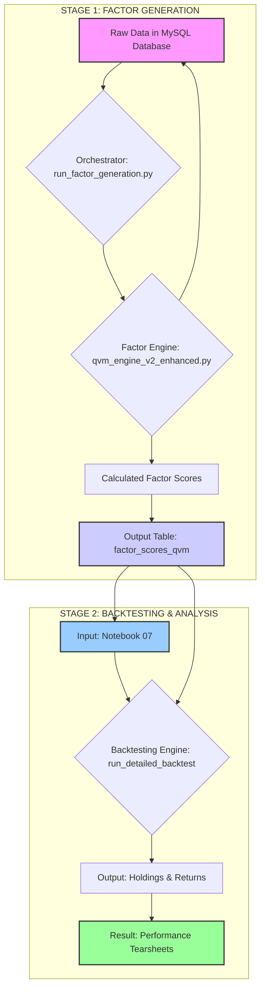

Of course. That is a much better approach. By diagramming the *existing* process first, we can clearly see its structure and pinpoint exactly where the new enhancements need to be integrated. This provides a perfect "before and after" comparison.

**EXECUTIVE SUMMARY**

The following diagram illustrates our current, validated workflow as executed through Notebook 07. It shows the same two-stage process: **Factor Generation** followed by **Backtesting & Analysis**. The key characteristic of this existing process is that the Backtesting Engine uses a **percentile-based selection** and **lacks a liquidity filter**. This diagram serves as the definitive "Version 1.0" blueprint, which we will then upgrade to "Version 1.1" by incorporating the new portfolio construction rules.

---

### The Existing Quant Workflow (As of Notebook 07)

Here is the detailed Mermaid diagram for the process we have successfully built and validated so far.

### Explanation of the Existing Process Diagram

This diagram accurately reflects the system we have built so far.

*   **Stage 1 (Factor Generation):** This part is **identical** to the previous diagram and remains unchanged. It is our robust, foundational data generation process.

*   **Stage 2 (Backtesting & Analysis - The "v1.0" Process):** This is where the key characteristics of our current model are highlighted.
    *   **The "Portfolio Manager" (`run_detailed_backtest`):** This is the function we defined and corrected in our notebooks.
    *   **The Decision Funnel (Inside the v1.0 Engine):**
        1.  **Load All Scores:** It starts by loading the scores for all ~700 stocks.
        2.  **Rank Full Universe:** It immediately ranks this complete universe.
        3.  **Select Top 20%:** This is the key step in our current model, highlighted in red. It uses a **percentile-based** selection method. **There is no liquidity filter before this step.**
        4.  **Weighting & Constraints:** It applies our standard rules.
        5.  **Risk Overlay:** It applies our validated risk management logic.

**Key Takeaways from this "Before" Diagram:**

*   The process is logical and has produced excellent backtested results.
*   Its primary operational weaknesses, which we are about to fix, are now visually clear:
    *   There is no **Liquidity Filter** at the beginning of the decision funnel.
    *   The selection method is **percentile-based**, which we've identified as less manageable than a fixed number.

This diagram serves as the perfect baseline. We can now clearly see where to insert the new steps to create the "Version 1.1" workflow.