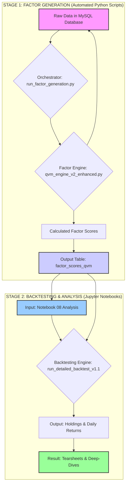

Of course. Visualizing the entire workflow is the best way to ensure absolute clarity. This Mermaid diagram will serve as the definitive architectural blueprint for our entire system, from raw data to the final, simulated portfolio performance.

**EXECUTIVE SUMMARY**

The following diagram illustrates the complete, end-to-end workflow of our quantitative investment process. It is divided into two distinct stages: **Stage 1: Factor Generation**, which is handled by our automated Python scripts (`qvm_engine` and `run_factor_generation`), and **Stage 2: Backtesting & Analysis**, which is performed within our Jupyter Notebooks. This separation is a critical institutional best practice, as it decouples the universal "scoring" of stocks from the specific "strategy simulation," allowing for robust, repeatable, and transparent research.

---

### The Complete Quant Workflow: From Raw Data to Strategy Performance

Here is the detailed Mermaid diagram. You can copy and paste this code into any Mermaid-compatible viewer (like the Mermaid Live Editor, or plugins in VS Code or Obsidian) to render the flowchart.

### Explanation of the Diagram

This diagram clearly separates the two major phases of our work.

#### **Stage 1: Factor Generation (The Foundation)**

*   **Starts with:** `Raw Data in MySQL Database` (our ultimate source of truth).
*   **The "Orchestrator" (`run_factor_generation.py`):** This is the factory manager. It's a script you run from the command line. Its job is to manage the process over a long historical period.
*   **The "Factor Engine" (`qvm_engine_v2_enhanced.py`):** This is the brain. The Orchestrator calls this engine for *each day* of the historical period. The engine's only job is to perform the complex, point-in-time correct calculations to produce a QVM score for every stock.
*   **Ends with:** The `factor_scores_qvm` Table. This database table is the final, clean output of Stage 1. It contains our proprietary "ingredients"—the daily factor scores for all stocks. This process is run infrequently, perhaps once a quarter, to update our historical data.

#### **Stage 2: Backtesting & Analysis (The Application)**

*   **Starts with:** Our `Notebook 08` and the `factor_scores_qvm` table. Our research and analysis work begins here.
*   **The "Backtesting Engine" (`run_detailed_backtest_v1.1`):** This is the "Portfolio Manager" function *inside our notebook*. It simulates the decision-making process of our specific strategy.
*   **The Decision Funnel (Inside the Backtesting Engine):** This shows the precise, sequential steps our "PM" takes on each rebalancing day:
    1.  It starts by loading the scores for *all* stocks.
    2.  It immediately applies the **Liquidity Filter**.
    3.  It ranks the remaining liquid stocks.
    4.  It applies the **Fixed-Number Selection** (Top 25).
    5.  It applies weighting and other constraints.
    6.  Finally, it applies the **Risk Overlay** to determine the final portfolio exposure.
*   **Ends with:** `Performance Tearsheets & Annual Deep-Dives`. The output of the backtesting engine (daily returns) is used to generate the final reports, charts, and analysis that we present to investors.

This diagram clarifies why the changes had to be made in the **Backtesting Engine** (Stage 2) and not the **Factor Generation Engine** (Stage 1). The Factor Engine's job is to score everything; the Backtesting Engine's job is to apply the specific rules of our strategy to that universe of scores.