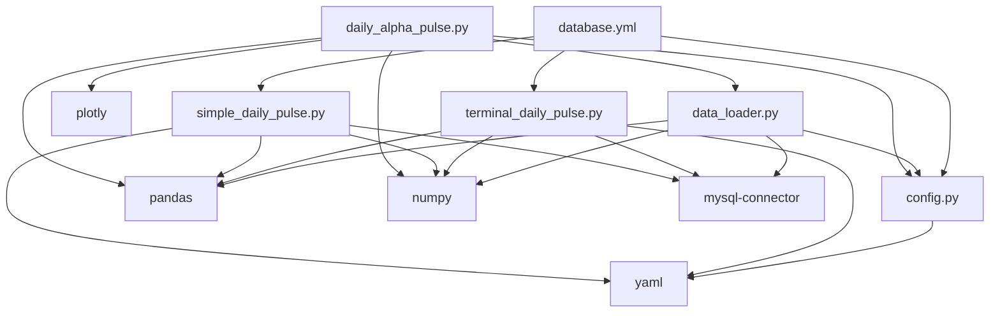
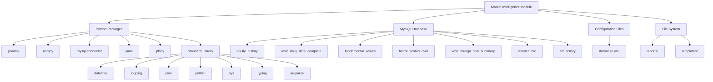
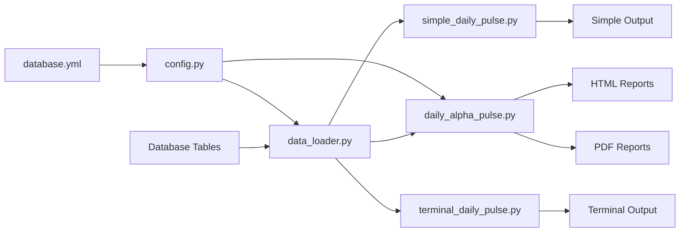
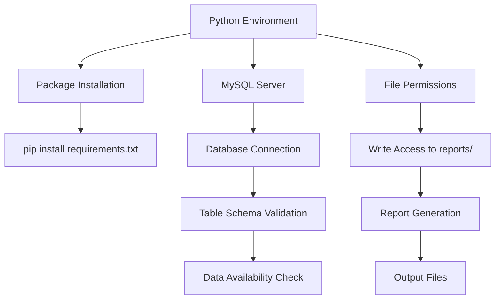
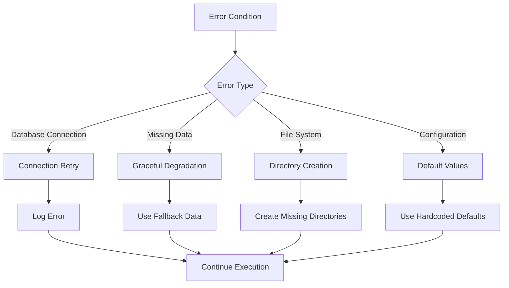
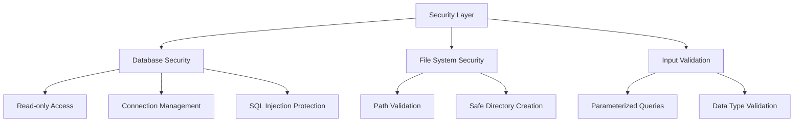
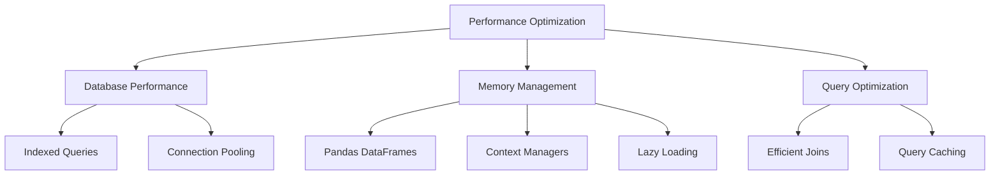
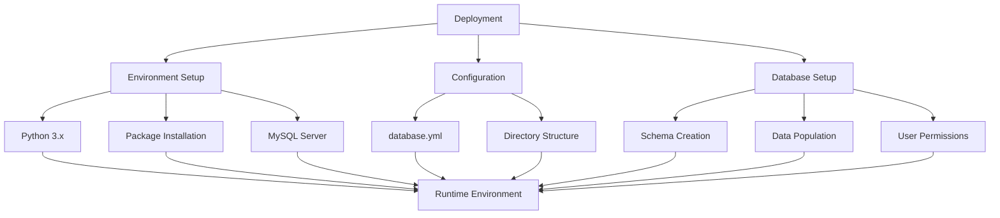

# Market Intelligence Module - Dependency Diagram

## Module Dependencies

## External Dependencies

## Data Flow Dependencies

## Runtime Dependencies

## Error Handling Dependencies

## Security Dependencies

## Performance Dependencies

## Deployment Dependencies

